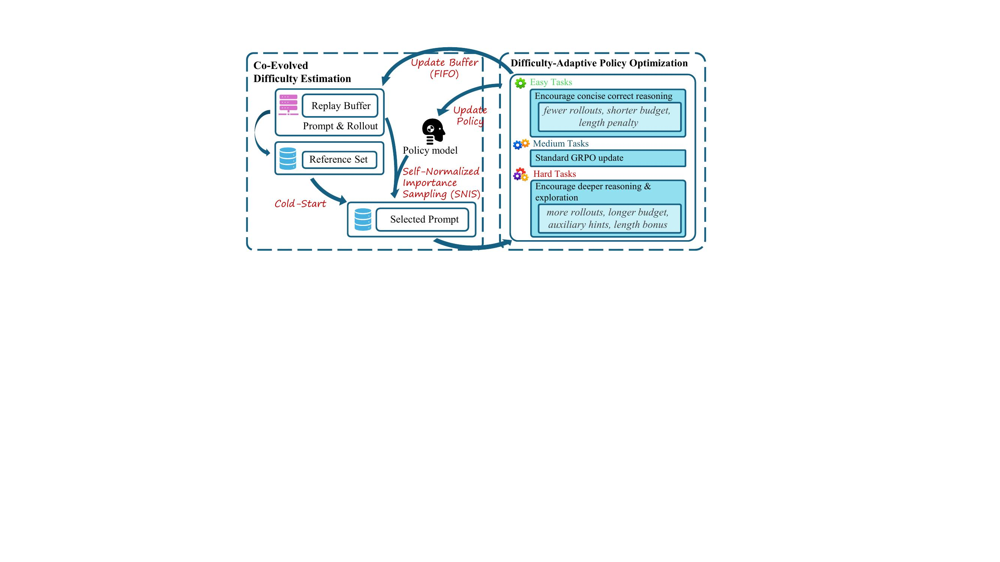
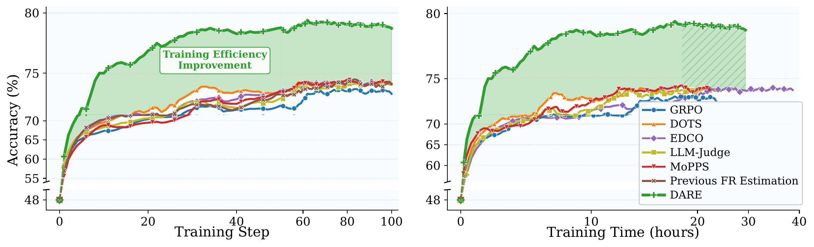

# DARE: Difficulty-Adaptive Reinforcement Learning with Co-Evolved Difficulty Estimation

Implementation of **DARE**, a difficulty-adaptive RL framework for LLM reasoning that couples policy-aligned difficulty estimation with difficulty-specific training strategies. DARE improves **training efficiency**, **final accuracy**, and **inference-time token usage** over existing difficulty-aware RL methods.

---

## Why DARE?

RL fine-tuning for LLM reasoning is expensive, and many rollouts produce weak learning signals. Prior *difficulty-aware data selection* methods (e.g., embedding-based, entropy-based, Bayesian bandit, and LLM-as-judge estimators) try to focus on medium-difficulty prompts, but an audit of these methods reveals three gaps:

1. **Inaccurate difficulty under policy drift.** Static or slowly-adapting estimators drift away from the current policy as training proceeds, so the "medium" prompts they pick are often trivially easy or intractably hard for the live policy.
2. **Limited final-performance gains from selection alone.** Filtration-only methods primarily shift *which* prompts are trained on; with enough budget they converge to roughly the same final accuracy as plain GRPO, leaving hard tasks unsolved.
3. **No change in inference efficiency.** Models trained with difficulty filtering still emit uniformly long CoT responses across difficulty levels.

DARE addresses all three at once.

## What DARE Does

DARE is organized around three components that run each epoch (see the pseudo-code in the paper appendix):

1. **Co-Evolved Difficulty Estimation (SNIS + FIFO buffer).**
   A prompt-wise FIFO replay buffer stores `(response, reward, behavior log-prob)` tuples. For each prompt, DARE estimates the *current-policy* failure rate via self-normalized importance sampling over the buffer, with a clipped log-ratio for stability. Unseen prompts get an embedding-based cold-start difficulty from a small reference set. The resulting estimate `d_q` co-evolves with the policy without re-rolling every prompt each step.
2. **Symmetric-Beta Dynamic Data Selection.**
   Prompts are sampled without replacement according to `p(q) ∝ Beta(d_q; α, α)` with `α = 1 + κ/2`. This keeps high probability mass on medium prompts (where GRPO's group-relative advantage is largest) while preserving a nonzero tail on easy and hard prompts, avoiding both easy-skill forgetting and hard-prompt starvation — a strict generalization over hard-threshold filtering.
3. **Difficulty-Adaptive Policy Optimization.**
   With thresholds `(d_easy, d_hard)`, prompts are partitioned into three tiers and trained differently:
   - **Easy** (`d_q < d_easy`): fewer rollouts `G_easy < G`, a length-weighted penalty on *correct* rollouts, and a relaxed upper clip `ε⁺ > ε` to learn concise correct solutions.
   - **Medium** (`d_easy ≤ d_q ≤ d_hard`): standard GRPO with `G` rollouts and symmetric clip `ε`.
   - **Hard** (`d_q > d_hard`): more rollouts `G_hard > G`, with a fraction drawn as **hint-augmented rollouts** (successful historical trajectories retrieved from the replay buffer), plus a bounded length bonus on *incorrect* rollouts to prevent early give-up. Correctness stays the dominant signal because `λ_hard < 1`.

Each batch mixes a fraction `σ` of fresh on-policy rollouts with `1 − σ` replay-buffer trajectories, trained under a difficulty-conditioned clipped surrogate objective.



## Empirical Highlights

Across three model scales (Qwen2.5-Math-1.5B, SmolLM3-3B-Base, Qwen2.5-Math-7B) and five math-reasoning benchmarks (MATH-500, GSM8K, AIME-AMC, MinervaMath, OlympiadBench), plus a code-generation transfer setting (HumanEval / MBPP / LiveCodeBench), DARE consistently:

- converges faster than GRPO, DOTS, EDCO, MoPPS, LLM-Judge, and Previous-FR baselines,
- produces **shorter** outputs on easy prompts and **higher** accuracy on hard prompts,
- improves final accuracy beyond filtration-only methods.



See the paper for full tables, ablations (reward-shaping, clipping, Beta concentration `κ`, SNIS clip `c`), and per-difficulty-level token/accuracy breakdowns.

---

## Installation

Tested with **Python 3.10 / 3.11** and **CUDA 12.1**. Pick one of the two setups.

### Option A — Conda (recommended for local boxes)

```bash
conda create -n dare python=3.10 -y
conda activate dare

cd rl_training
pip install -e ./verl
pip install -r ../requirements.txt
```

### Option B — One-shot bootstrap

`environment.sh` creates a fresh conda env on local SSD, installs a matching `torch` + prebuilt `flash-attn` wheel, then installs the local `verl`:

```bash
bash environment.sh
```

---

## Stage 1 — Cold-Start Difficulty Estimator (Optional but Recommended)

DARE uses an embedding-based teacher only for **prompts without buffered rollouts**. If you already ship a cached teacher bank (see `adaptive_difficulty_prediction/all_merged_teacher_bank/` and `adaptive_difficulty_prediction/outputs/…/model_final.pt`), you can skip straight to Stage 2.

To retrain the cold-start teacher on your own data:

1. Prepare training data. In `adaptive_difficulty_prediction/load_data.py`, replace the training and reference pickles; see formats under `adaptive_difficulty_prediction/datasets/`.
2. Run embedding extraction and teacher training:

   ```bash
   cd adaptive_difficulty_prediction
   bash run_bash/run_embed.sh
   bash run_bash/run_train.sh
   ```

The resulting checkpoint is consumed by the RL trainer via `TEACHER_MODEL_CHECKPOINT_PATH` and `teacher_model.embedding_path` (set in the scripts under `rl_training/run_bash/`).

---

## Stage 2 — DARE RL Training

All training entry points live in `rl_training/run_bash/`. They share `common_ds_teacher_replay_config.sh`, which exposes the key DARE knobs:

| Group | Variable | Meaning |
|---|---|---|
| Selection | `SELECTION_METHOD` | `is` (SNIS), `bayesian` (MoPPS-style), `teacher` (DOTS), `LLM_predict`, or `""` (uniform). |
| Selection | `SAMPLE_DIST_TYPE` + `BETA_PEAK` / `BETA_KAPPA` | Enable `beta` to match the paper's symmetric-Beta sampler. |
| SNIS | `IS_CLIP_RANGE`, `IS_ESS_THRESHOLD`, `IS_TOKEN_CLIP_EPSILON` | Clipping `c`, ESS fallback, and token-level IS clip. |
| Rollouts | `NUM_GENERATIONS`, `MAX_NUM_GENERATIONS` | Base `G` and max group size for tiered reallocation. |
| Tiered shaping | `EASY_THRESHOLD`, `EASY_LENGTH_PENALTY_COEFF` | `d_easy` and `λ_easy`. Set coeff to `0` to disable. |
| Tiered shaping | `HARD_LENGTH_THRESHOLD`, `HARD_LENGTH_BONUS_COEFF` | `d_hard` and `λ_hard`. |
| Hard memory | `HARD_MEMORY_*` | Control hint-augmented rollouts (retrieval from replay buffer). |
| Replay | `SIGMA`, `BUFFER_SIZE`, `REPLAY_STRATEGY` | Fresh/replay mix and buffer capacity. |
| Clipping | `POLICY_CLIP_RATIO`, `POLICY_CLIP_LOWER_BOUND`, `POLICY_CLIP_UPPER_BOUND` | Base `ε`, with optional relaxed upper clip for easy prompts. |

Recommended defaults matching the paper: `IS_CLIP_RANGE=4.0`, `BETA_KAPPA=100`, `(EASY_THRESHOLD, HARD_LENGTH_THRESHOLD) = (0.3, 0.8)` (i.e. `d_easy=0.3`, `d_hard=0.8` measured as failure rate), `(G_easy, G, G_hard) = (4, 8, 16)`, `λ_easy = λ_hard = 1e-4`.

### Run

```bash
cd rl_training

# Small model, single node: Qwen2.5-Math-1.5B on DeepScaleR
bash run_bash/1_ours_small_model.sh
# or the 4-GPU variant
bash run_bash/2_ours_small_model.sh

# IS-only selection baseline
bash run_bash/IS_big_model.sh

# Large model: Qwen2.5-3B on 8 GPUs with teacher + replay
bash run_bash/12_final_ds_teacher_replay.sh
```

Each script prints the resolved paths (`TEACHER_ROOT`, `OUTPUT_BASE`, Ray port, CUDA devices, wandb name) before launching. Output checkpoints and eval CSVs land under `rl_training/output/<model>/<run>/`.

### Evaluation

`EVALUATE_DATASET` selects which benchmarks run each epoch; defaults to `math500,aime2024,aime2025,gsm8k,aimo_amc`. Per-epoch accuracies are written to `plots/eval_results.csv` inside the run directory.

---

## Repository Layout

```
.
├── adaptive_difficulty_prediction/   # Stage 1: embedding teacher + cold-start estimator
│   ├── load_data.py, train.py, save_embedding.py, model.py
│   ├── datasets/                     # example data formats
│   └── run_bash/{run_embed.sh, run_train.sh, run_train_coding.sh}
├── rl_training/                      # Stage 2: DARE RL loop
│   ├── verl/                         # local verl fork (editable install)
│   └── run_bash/*.sh                 # entry points (see table above)
├── environment.sh                    # one-shot bootstrap
└── requirements.txt
```

The core DARE logic lives in `rl_training/verl/verl/trainer/ppo/` — notably `is_data_selector.py` (SNIS + Beta sampler + Bayesian variant) and `ray_trainer.py` (tiered rollout allocation, reward shaping, replay mix).

---

## Acknowledgements

Parts of this code build on [`verl`](https://github.com/volcengine/verl) and [`rllm`](https://github.com/agentica-project/rllm). We thank the authors for releasing their implementations.
